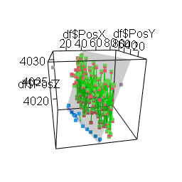

# Pillar-Modiolar Localization V3.2

  

# How to install
This github contains four zip files. Choose the right zip according to whether you're analyzing spots or surfaces.
Choose the zip with the right Imaris version. The Imaris 9.7.2 scripts will work as long as Imaris does not change the format of the Excel outputs in newer versions.

Recommended: download the scripts, either download the full code containg all four releases in ZIP format from this screen, or click on the zip you need and press "Download". 
Not recommended: download the release you need from the 'Releases' tab on the right. Note, this install method requires manually creating a folder called "Input".

# Instructions
For detailed instructions, see the "Readme.txt" file that is bundled with the scripts.
1. Export your data from Imaris with the correct names for your spots and surfaces (i.e., "Ribbons","Nucleus","PSD","Pillar","Modiolar"). Or change the names in the label section of "Masterscript.R".
2. Convert the Imaris output from XLS to XLSX (a macro is bundled with the scripts to convert a batch of XLS files simultaneously).
3. Copy the XLSX file into the "Input" folder. If no folders are there, make a folder called "Input" or run the masterscript once without copying a file.
4. Run "Install packages.R" if this is your first time using this script. Run this again whenever you update from an older version of this script.
5. Open 'Masterscript.R", check the settings and press "Source".

NOTE: if you only exported ribbon volumes, set "Ribbonsonly" to "TRUE" in "Synapse_script.R" before running the script. When running the script with only ribbon data, R will give the following error message: "In min(tmp) : no non-missing arguments to min; returning Inf". This can be ignored.

# Changelog:
Version 3.2 (Final) - bug fixes
- Update only applies to volume analysis scripts.
- All scripts updated to latest reviewed date.
- Graphs now properly show only ribbons without deleting unpaired ribbons when selecting Ribbonsonly=TRUE.
- Graphs now properly reflect whether normalized volumes or raw volumes are used.
- Fixed bug in which Ribbon:PSD pair statistics would not show up in the masterscript.

Version 3.1 - analysis of individual pairs
- Update only applies to volume analysis scripts
- Analysis by pairs added. The processed file now contains a sheet that shows which ribbon is paired with which PSD. The ratios of ribbon/PSD volumes are calculated. Pillar and modiolar means and medians of normalized and raw volume ratios are added.
- Mean/median raw/normalized pillar/modiolar volumes are added to mastersheet.
- NOTE: this version requires the installation of the 'dplyr' and 'tidyr' packages. Run 'install.packages.R' before running script.

Version 3.0 - script loop and automatic mastersheet
- Skipped for volume analysis script for Imaris 7.7.2
- Reorganized the script design. The smaller scripts are now controlled by the "Masterscript".
- Added looping of the scripts. Multiple files can now be analyzed at once without manual copy/pasting after every run.
- Added configurable label names. If the names of the objects in Imaris do not match with the script (e.g., "IHC" instead of "Nucleus"), you can configure these custom names in the masterscript.
- Added automatic mastersheet. The calculated averages, medians and counts will automatically be pasted in the "Mastersheet". Every file analyzed will create a new row and the filename is visible in the first column. A mastersheet will automatically be created when none is detected.

Version 2.3 - bug fixes
- Fixed bug in which processing multiple files would give error that the directories are already created.
- Fixed bug in which no unpaired ribbons/psds would delete the entire dataframe and induce a fatal error.

Version 2.2 - counts and visualization
- Added counts per inner hair cell for volume analysis scripts.
- Reorganized statistics. The output excell files now contain four sheets with different categories of data, since 45 columns on one sheet became too cluttered.
- Added a setting to make histograms and boxplots of the volumes in the output excel file for the volume analysis scripts.
- Added a setting to make barplots of the counts in the output excel file for the spot localization script.
- Removed redundant lines of code.

Version 2.1 - bug fixes and removal of unpaired synapses
- Fixed a bug in which no average/median/counts would be outputted if no spots have the ID 'Rib0' or 'PSD0'.
- Fixed 3D figure renders. Now shows spots in correct size and the pillar/modiolar axis is now transparent.
- Fixed 'NAs introduced by coercion' after principal component analysis.
- Fixed a bug in which the reformatting script would give an error message that the column names are automatically changed.
- Fixed a bug in which pressing 'source' would not work properly. It is no longer needed to run each line manually anymore. 
- Introduced various checkpoints with status updates throughout the script.
- Added a setting to select whether only ribbons or both ribbons and PSDs are analyzed.
- Updated the euclidian distance section to automatically remove data of unpaired/orphan ribbons or PSDs (setting ribbonsonly = TRUE reverses this).
- Added counts of unpaired modiolar/pillar ribbons/PSDs.

Version 2.0 - redesign
- It is no longer needed to manually reformat the Imaris Excel sheets. The script does it automatically.
- The output of the script is neatly organized and formatted.
- Descriptive statistics, such as means and medians are added.
- All relevant data is bundled into a single output file.
- Seperate versions for spots or surfaces in the older or newer Imaris versions are added.
